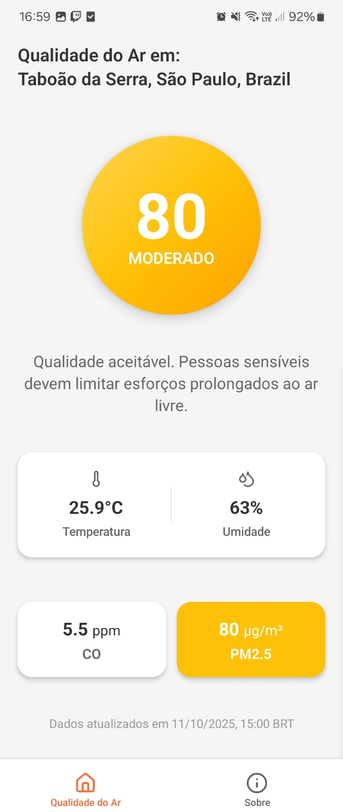
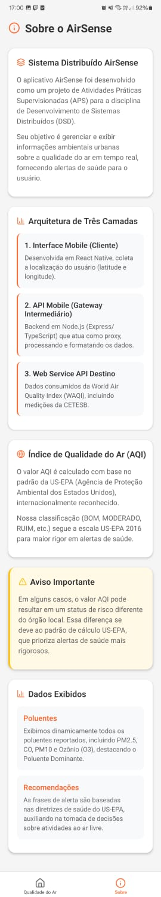

# AirSense App


## 📝 Descrição

Um aplicativo mobile para exibir dados de qualidade do ar em tempo real, baseado na localização do usuário.

**Contexto do Projeto:** Este aplicativo faz parte do projeto de **Atividades Práticas Supervisionadas (APS)** da disciplina de **Desenvolvimento de Sistemas Distribuídos (DSD)** no curso de Ciência da Computação (UNIP). Ele serve como o _Cliente_ do nosso sistema, consumindo dados da [AirSense API](https://github.com/wellingtonrsantos/airsense-api).

## 🚀 O que faz?

Este aplicativo atua como o Cliente do nosso Sistema Distribuído. Ele obtém a localização do usuário, envia as coordenadas para a AirSense API (o Gateway Intermediário) e exibe os dados de qualidade do ar recebidos de forma clara e amigável, fornecendo alertas visuais e recomendações de saúde baseadas no padrão US-EPA.

## 📱 Telas do Aplicativo

|                            Tela Principal                            |                            Tela Sobre                             |
| :------------------------------------------------------------------: | :---------------------------------------------------------------: |
|  |  |

## 🔗 Pré-requisito: Iniciando a AirSense API (Gateway DSD)

Para que este aplicativo funcione, a `airsense-api` **deve estar em execução**, pois ela é a fonte de dados.

### Como rodar a API localmente

1.  **Clone o repositório da API:**
    ```bash
    git clone https://github.com/wellingtonrsantos/airsense-api
    cd airsense-api
    ```
2.  **Instale as dependências:**
    ```bash
    npm install
    ```
3.  **Crie um arquivo `.env`** na raiz do projeto e adicione seu token da AQICN:
    ```
    AQICN_TOKEN="<COLE_O_SEU_TOKEN_AQUI>"
    ```
4.  **Inicie o servidor da API:**
    ```bash
    npm run start:dev
    ```
    A API estará rodando em `http://localhost:3000`.

### Como rodar a API com Docker

1.  **Execute o comando abaixo, substituindo pelo seu token:**
    ```bash
    docker run -d -p 3000:3000 --name airsense-api -e AQICN_TOKEN="<COLE_O_SEU_TOKEN_AQUI>" wellingtonrsantos/airsense-api:1.0.0
    ```
    A API estará acessível em `http://localhost:3000`.

## 💻 Como rodar o App localmente

**Pré-requisitos:**

- [Node.js](https://nodejs.org/) (versão 20 ou superior)
- [npm](https://www.npmjs.com/)
- O aplicativo **Expo Go** no seu celular (Android ou iOS)

**Passos:**

1.  **Clone o repositório:**
    ```bash
    git clone https://github.com/wellingtonrsantos/airsense-app
    cd airsense-app
    ```
2.  **Instale as dependências:**
    ```bash
    npm install
    ```
3.  **Inicie o aplicativo:**
    ```bash
    npx expo start --tunnel
    ```
4.  **Abra no seu celular:**
    - Escaneie o QR code exibido no terminal com o app Expo Go.

## 🐳 Como rodar o App com Docker

A imagem já está disponível no [Docker Hub](https://hub.docker.com/r/wellingtonrsantos/airsense-app).

**Pré-requisitos:**

- [Docker](https://www.docker.com/)
- O aplicativo **Expo Go** no seu celular (Android ou iOS)

**Passos (Recomendados para Interatividade):**

1.  **Inicie o Ambiente (Container em Background):**
    O comando abaixo irá baixar a imagem, iniciar o container e mapear a porta do Metro Bundler (8081) em modo _detached_ (segundo plano). O `sleep infinity` é usado para manter o container vivo.

    ```bash
    docker run -d -p 8081:8081 --name airsense-app wellingtonrsantos/airsense-app:1.0.0 sleep infinity
    ```

2.  **Inicie o Metro Bundler (Interativo):**
    Agora, use `docker exec` para entrar no container e iniciar o processo de desenvolvimento interativo com a funcionalidade de túnel.

    ```bash
    docker exec -it airsense-app npx expo start --tunnel
    ```

    - O QR code será gerado no seu terminal.

3.  **Abra no seu celular:**
    - Escaneie o QR code exibido no terminal com o app Expo Go.

**Para Parar e Remover (Limpeza Completa):**

Quando terminar, pare e remova o container que estava rodando em segundo plano:

```bash
docker stop airsense-app
docker rm airsense-app
```
